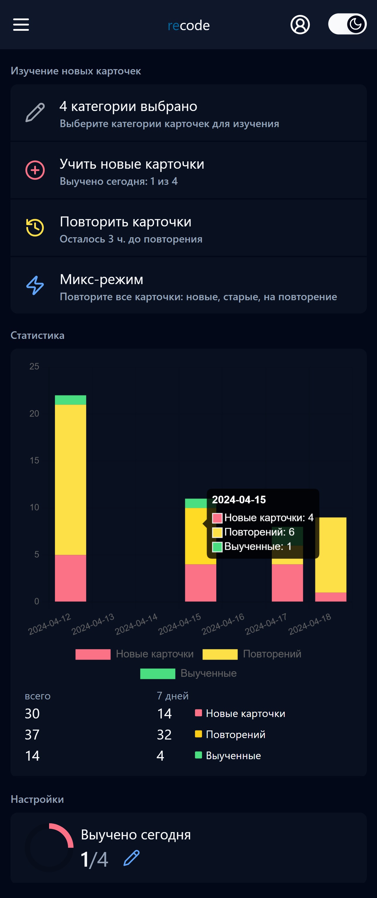
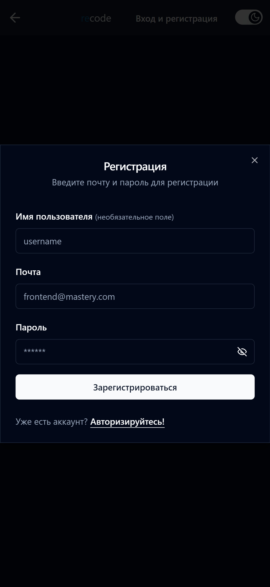
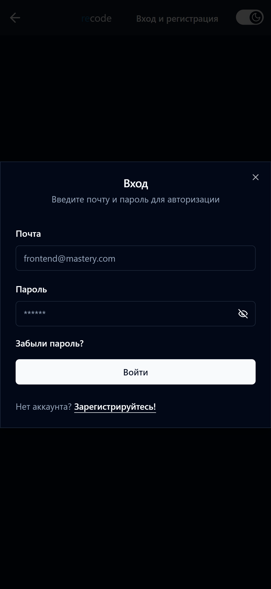
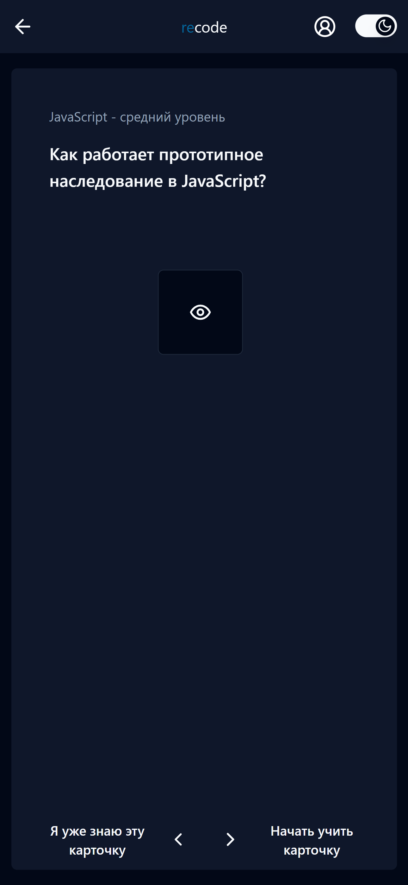
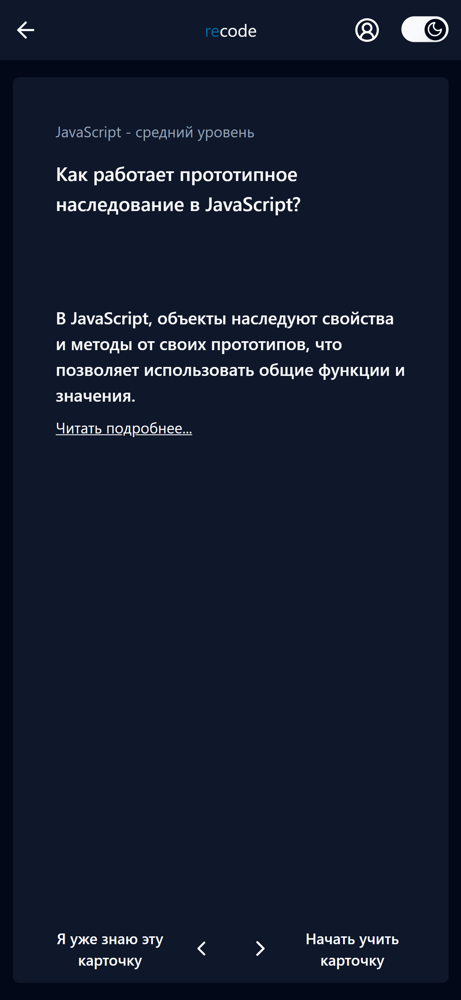
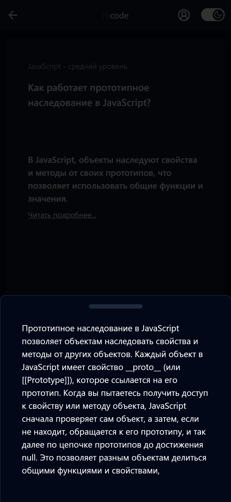

## recode

#### Приложение для изучения карточек "вопрос-ответ"








#### О приложении

Приложение в формате memorize для изучения карточек "вопрос-ответ".
У каждой карточки обязательно есть короткий ответ на вопрос и опционально:

-   подробный ответ (в drawer'е появляется полный и развёрнутый ответ на вопрос; _todo: сделать возможность добавлять, кроме текста, картинки и код_);
-   варианты ответа (от 2-х до 4-х).

**Приложение универсально**. Можно _on the run_ из приложения по изучению программирования сделать приложение по изучению иностранных слов, по изучению любого другого предмета, подходящего под формат "вопрос-ответ".

#### Механика приложения

Для запоминания человеку требуется в среднем 6-9 повторений с разными временными интервалами.

Пользователь может выбрать количество карточек для изучения в день, а далее они уходят в статус to learn и повторяются с интервалами:
| Кол-во повторений | Время до следующего повторения |
|-------------------|--------------------------------|
| 0 | 30 мин. |
| 1 | 2 ч. |
| 2 | 6 ч. |
| 3 | 24 ч. |
| 4 | 2 дн. |
| 5 | 4 дн. |
| 6 | 8 дн. |
| 7 | 16 дн. |
| 8 | 32 дн. |
| 9 | memorized! |

#### Стек проекта:

##### Сервер

`Node.js, Express.js, Prisma.js, jsonwebtoken, nodemailer, uuid, zod, postgresql`
Аутентификация выполнена на JWT-токенах.
Подтверждение регистрации аккаунта выполняется с помощью ввода кода, который приходит пользователю на почту при регистрации. Отправка писем через SMTP mail\.ru.

##### Клиент

```
TypeScript, React.js, react-router-dom, MobX,
react-hook-form, zod, axios,
chart.js, sonner,
i18n,
Tailwind, Scss, Css modules, shadcn/ui,
Webpack, Babel
```

#### Для локального запуска приложения:

/client:
`npm i`
`npm start`

/server:
`npm i`
`npm run dev`

Перед запуском приложени, необходимо выполнить настройку подключения БД к Prisma (см. список поддерживаемых БД ORM Prisma) и далее:
`npx prisma generate`
`npx prisma db push`

Для удобного просмотра, редактирования БД:
`npx prisma studio`

Необходимо добавить переменные .env:

```
DATABASE_URL=
SERVER_PORT=5000
JWT_ACCESS_SECRET=указываем любую рандомную строку
JWT_REFRESH_SECRET=указываем любую рандомную строку
SMTP_HOST=для настройки smpt
SMTP_PORT=для настройки smpt
SMTP_USER=для настройки smpt
SMTP_PASSWORD=для настройки smpt
API_URL=url сервера
CLIENT_URL=url клиента
```

#### TODO:

1. Мнорепозиторий: главная страница на Next.js (ISR); основное приложение на React.js + MobX, админка на React.js + Redux;
2. Админка: добавить, удалить или отредактировать категорию/карточку; открыть список всех пользователей с возможностью дать/убрать права доступа (ADMIN);
3. **coming soon...**
